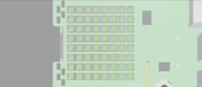
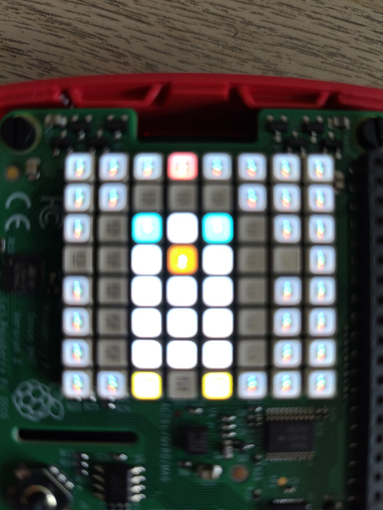
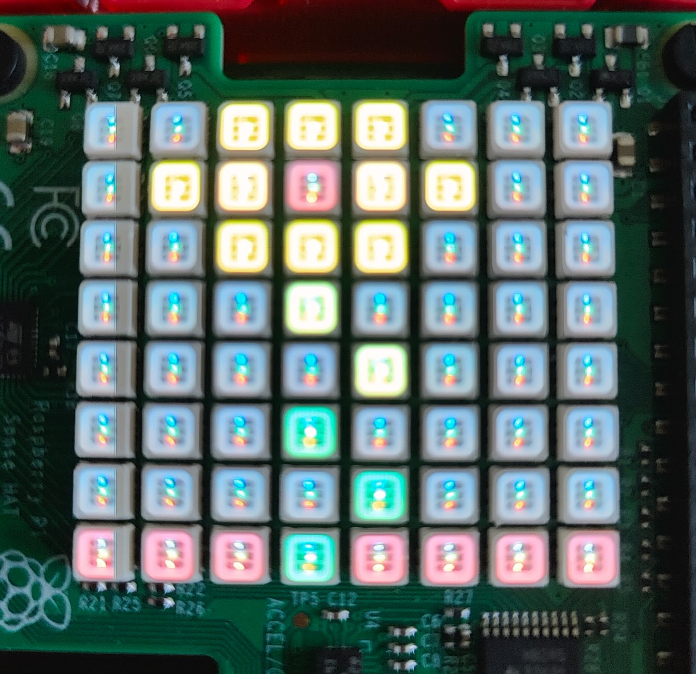
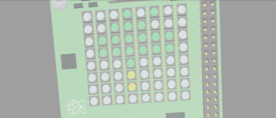

# 2024 - Flora and Fauna

Ninjas wrote a program to display a personalised image (or series of images) on an Astro Pi computer on board the ISS to remind the astronauts of home, using a reading from the Astro Pi’s colour and luminosity sensor to set the colour of the background.

## Alex

## Alfie

## Christian

## Daniel

## Embla

## Freddie

## Sam

## Soren

## Theo

## Tom

