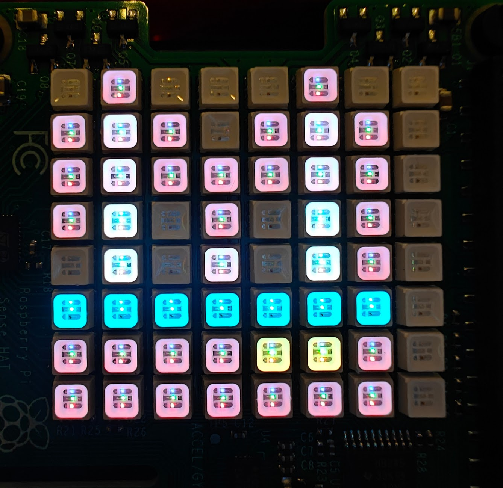

# 2025 - Nature

Ninjas wrote a program to display a personalised image (or series of images) on an Astro Pi computer on board the ISS to remind the astronauts of home, using a reading from the Astro Pi’s colour and luminosity sensor to set the colour of the background.

## Alfie

## Arthur

## Minnie

## Theo

## Will

